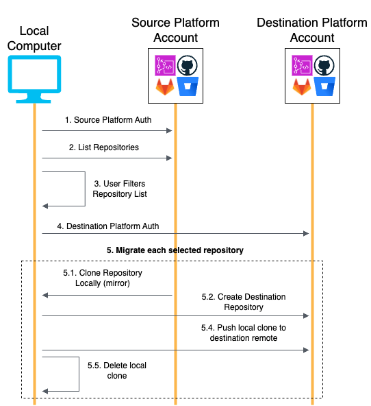

# Migrating CodeCommit repositories between AWS Accounts or between Regions in bulk with a Python script

Migrating CodeCommit repositories between AWS Accounts is a simple but repetitive process that can be automated for large-scale migrations. In this artifact, we share a Python script that provides a user-friendly interface to automate the migration of repositories in bulk. Using profiles configured for the AWS CLI, this tool makes it easy to move hundreds CodeCommit repositories in one command. The tool can also be used to migrate repositories between regions in one account when using the same profile for source and destination.

First the script fetches the full list of CodeCommit repositories in the source account. Then the user is asked to filter and/or validate the list of repositories to be migrated to the destination account. For each of the selected repositories, it clones the source repository locally (as a mirror including files and metadata). The script then creates the target repository on the destination account with matching name (with an optional custom prefix) and description. The local clone is then pushed to the destination remote and removed from the local disk.

---
Warning: This scenario requires IAM users with programmatic access and long-term credentials, which present a security risk. To help mitigate this risk, we recommend that you provide these users with only the permissions they require to perform the task and that you remove these users when they are no longer needed. Access keys can be updated if necessary. For more information, see [Updating access keys](https://docs.aws.amazon.com/IAM/latest/UserGuide/id_credentials_access-keys.html#Using_RotateAccessKey) in the IAM User Guide.
---

## Prerequisites

- [Python 3](https://www.python.org/), [Pip](https://pypi.org/) installed
- [AWS CLI](https://aws.amazon.com/cli/)
- A Source Account currently hosting the repositories to be migrated
- A Destination Account where to migrate the repositories
- Sufficient local disk space to clone the largest repository to be migrated

## Limitations

- The tool has been built to fit most common large-scale CodeCommit migration needs. You can tweak the source code and improve the tool to fit more specific needs (e.g. using regex to filter repositories, add suffixes to migrated repositories etc.)

## Script sequence diagram



## Automation and scale

- The tool automatically migrates CodeCommit repositories between AWS Accounts and can be used in any-scale migration projects.
- One can bypass the user prompt to filter and/or validate the list of repositories to be migrated by using the `--migrate_all` argument.

## Best practices

- Grant the least required permissions (see the IAM Policies in Additional Information) to the IAM users with programmatic access used to configure the AWS CLI Profiles
- Review the list of repositories to be migrated and filter out irrelevant repositories if needed
- Use a prefix to identify repositories that have been migrated to the destination account by using the `--repo_prefix` argument
- Ensure local disk space if sufficient to clone the largest repository to be migrated

## Installation and Usage

### Configure AWS CLI Profiles

This section describes how to create IAM Users with programmatic access, the least required permissions to perform the migration and to configure the respective AWS CLI Profiles.

You may skip this part if your profiles are already configured.

#### Configure the AWS CLI **Source** Profile
1. Sign in to your **Source** AWS Account (account hosting the repositories to migrate)
2. Create an IAM user that has the “IAM Policy **Source** Account” (see Additional Information Section) as inline policy
3. Note the access key ID and secret access key
4. Run `aws configure --profile <source_account_profile>` and enter the access key ID, secret access key and default region

#### Configure the AWS CLI **Destination** Profile
1. Sign in to your **Destination** AWS Account (account where to migrate the repositories)
2. Create an IAM user that has the “IAM Policy **Destination** Account” (see Additional Information Section) as inline policy
3. Note the access key ID and secret access key
4. Run `aws configure --profile <Destination_account_profile>` and enter the access key ID, secret access key and default region

#### (Optional) Best Practice - Use SSO Login configurations

If a Single Sign-On Identity Provider (SSO IdP) is available to access your accounts, please consider using short-lived tokens authentication as a security best practice.

The following documentation page describes how to create AWS CLI Profiles with SSO IdP: [Token provider configuration with automatic authentication refresh for IAM Identity Center](https://docs.aws.amazon.com/cli/latest/userguide/sso-configure-profile-token.html)

### Download and Setup the Python Script

1. Clone the git repo
2. Setup a Python virtual environment and install the required libraries: 
```bash
python3 -m venv .venv
source .venv/bin/activate
pip3 install -r requirements.txt
```

### Run the script and migrate the repositories

1. Run the script:
```bash
python3 codecommit-migration.py --source_profile <source_account_profile> —-destination_profile <destination_account_profile>
```
2. The script prints the full list of CodeCommit repositories in the source account and offers the possibility to filter and/or validate the list of repositories to be migrated:  
***Repositories to exclude: (eg: "1 2 3", "1-3", "^4" or repo name)  
Note: This list will be used to filter the list of repositories to be migrated.  
Note: If you want to migrate all repositories, leave this field empty.***
3. The repositories are being migrated and the script prints its progress

PS: for same account cross-region migrations, use the same profile as source and destination, and use the `-—source_region` and `-—destination_region` to specify the respective regions.

#### Optional Arguments

- `--repo_prefix {custom_prefix}` Adds the chosen prefix to the migrated repositories name on the destination account
- `--migrate_all` Set this if you want to bypass the user filter/validation input and migrate all repositories
- `--source_region {source_aws_region}` AWS Region of the Source Account (default: Source Account CLI Profile)
- `--destination_region {destination_aws_region}` Targeted AWS Region on the Destination Account (default: Destination Account CLI Profile)
- `--dry_run` Simulate the migration without making changes
- `--log_level` Set the logging level (DEBUG, INFO, WARNING, ERROR), defaults to INFO

## Related resources

Migrate a Git repository to AWS CodeCommit - AWS CodeCommit Documentation ([link](https://docs.aws.amazon.com/codecommit/latest/userguide/how-to-migrate-repository-existing.html))

## IAM Policies

### Source Account

```json
{
  "Version": "2012-10-17",
  "Statement": [
    {
      "Sid": "CodeCommit-Migration-Source-Account-Access",
      "Action": [
        "codecommit:GetRepository",
        "codecommit:GitPull",
        "codecommit:ListRepositories"
      ],
      "Effect": "Allow",
      "Resource": "arn:aws:codecommit:$<Set_Region>:$<Set_Source_Account_Number>:$*"
    }
  ]
}
```

### Destination Account

```json
{
  "Version": "2012-10-17",
  "Statement": [
    {
      "Sid": "CodeCommit-Migration-Destination-Account-Access",
      "Action": [
        "codecommit:GetRepository",
        "codecommit:CreateRepository",
        "codecommit:GitPush"
      ],
      "Effect": "Allow",
      "Resource": "arn:aws:codecommit:$<Set_Region>:$<Set_Destination_Account_Number>:$*"
    }
  ]
}
```

## Security

See [CONTRIBUTING](CONTRIBUTING.md#security-issue-notifications) for more information.

## License

This library is licensed under the MIT-0 License. See the LICENSE file.